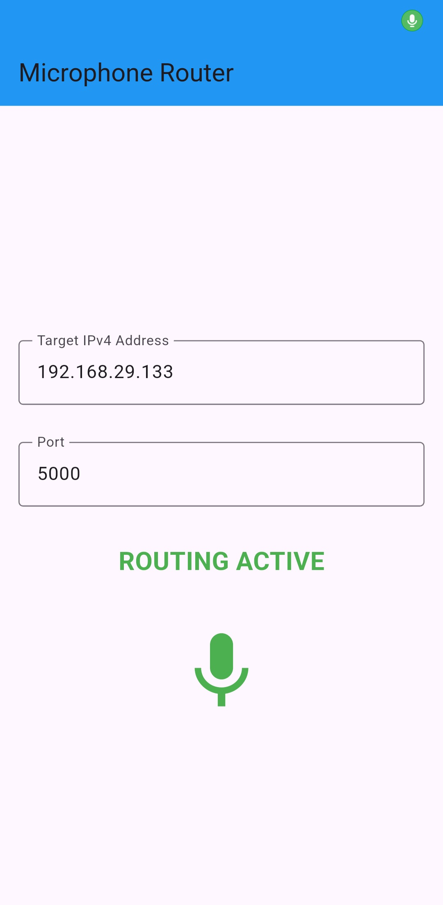

# Microphone-Router
Route your microphone data over the intranet or internet.

## Motivation
I wanted to use my Phone's microphone as my laptop's, so here I am. The android-client uses Flutter and has a rough and simple UI. The Android app's audio capture and UDP streaming logic are written in C++ to lower latency, with the former using [Google's Oboe](https://github.com/google/oboe) Library. View [`audio_router.cpp`](https://github.com/nullptr0x/MicrophoneRouter/blob/main/microphone_router/src/audio_router.cpp) if you are interested in the implementation.

## Usage

Fetch your laptop's LAN IP:
```bash
$ hostname -I
```

Enter this IP and a port in the app, then press the microphone icon to start streaming, like the example
shown below:
<div align="center">

</div>

### Receive audio on your laptop

Verify that the UDP data is arriving via netcat:
```bash
$ nc -ul -p <port> | xxd
```
If nothing shows up, allow the port in your firewall:
```bash
$ sudo firewall-cmd --add-port=<port>/udp
```

Create a virtual microphone device (requires PipeWire):
```bash
$ pw-loopback \
  --name="Virtual_Mic" \
  --capture-props="media.class=Audio/Sink node.name=Virtual_Mic_In node.description='Virtual Mic Input'" \
  --playback-props="media.class=Audio/Source node.name=Virtual_Mic node.description='Virtual_Mic'"
```

Feed the UDP stream into the virtual mic using GStreamer:
```bash
$ gst-launch-1.0 udpsrc port=5000 ! \
        "audio/x-raw,format=F32LE,rate=48000,channels=1,layout=interleaved" ! \
        audioconvert ! audioresample ! \
        pipewiresink target-object="Virtual_Mic_In"
```

Your apps can now select "Virtual_Mic" as an audio input source.

## Build Requirements
- **Flutter SDK**
- **Android NDK + CMake**

## Build & Run
```bash
git clone https://github.com/nullptr0x/MicrophoneRouter.git
cd MicrophoneRouter/microphone_router

flutter pub get
flutter run
```